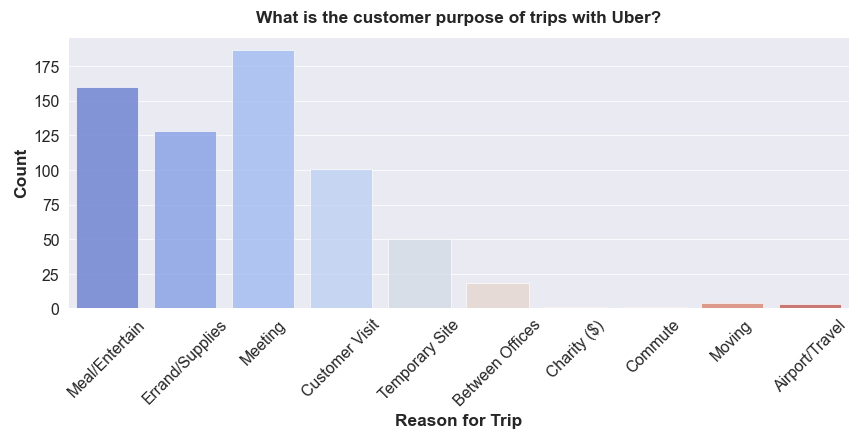

<h1>Uber EDA and Data Visualization</h1>

<h2>What is Uber?</h2>

Uber Technologies, Inc., commonly known as Uber, is an American technology company. Its services include ride-hailing, food delivery, package delivery, couriers, freight transportation, and, through a partnership with Lime, electric bicycle and motorized scooter rental.

I will use data regarding Uber ride

<h3>Project Overview:</h3>

<ul>
    <li>Check how long do people travel with Uber?</li>
    <li>Check The Purpose Of Trips?</li>
    <li>Which Day Has The Highest Number Of Trips?</li>
    <li>What Month has the highest number of Trips?</li>
    <li>What category are the trips categorize in and which category has the most trips?</li>
    <li>Where Do People Start Boarding Their Trip From?</li>
</ul>

Here is one data visualisation for one question answered above:

<h2>Requirements</h2>

<ul>
    <li>
Python 3 or latest version
</li>
    <li>
Jupyter Notebook
</li>
</ul>

<h2>Dependencies</h2>

<ul>
    <li>
pandas
</li>
    <li>
numpy
</li>
    <li>
seaborn
</li>
    <li>
matplotlib
</li>
</ul>
